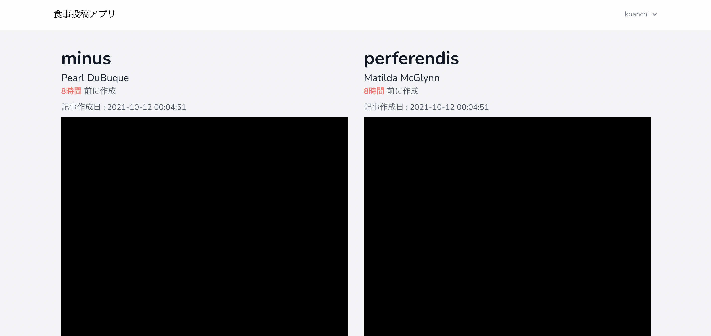
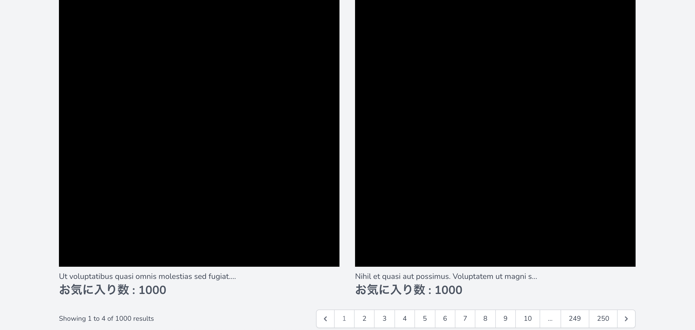
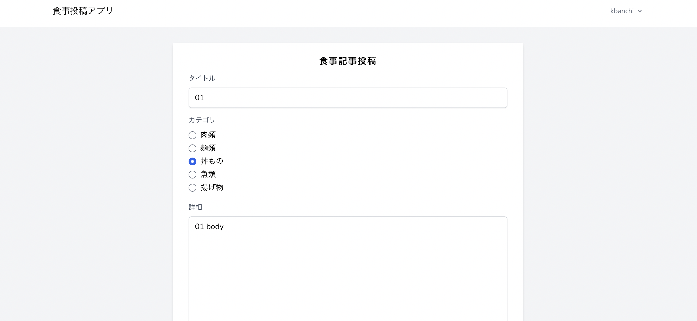
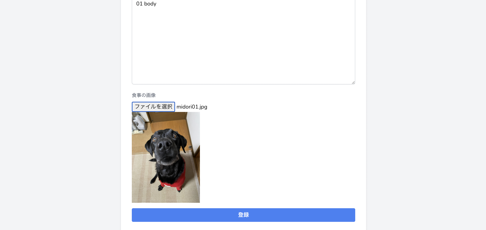
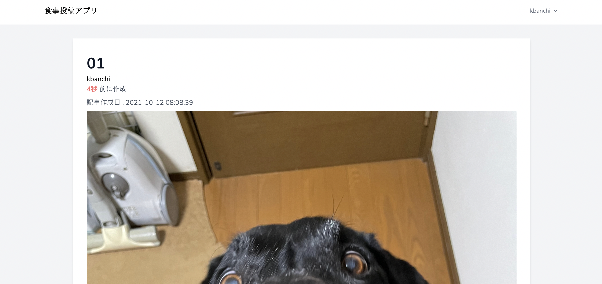
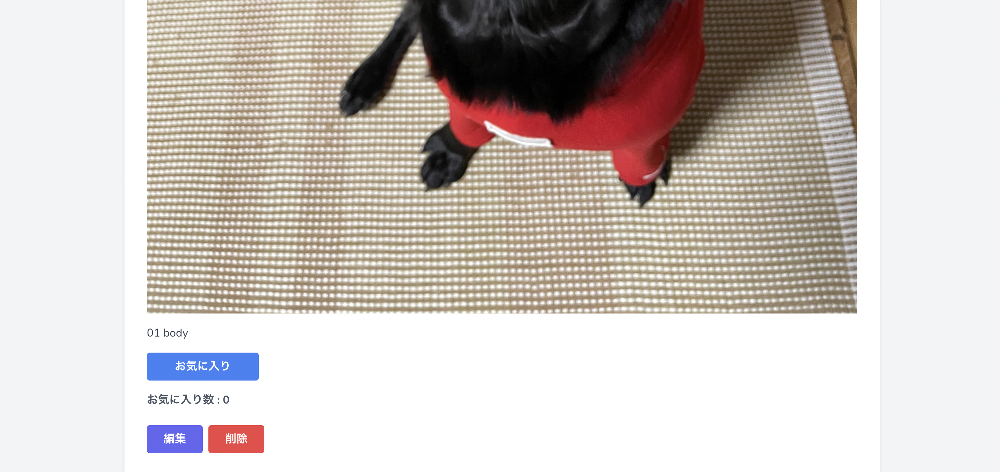
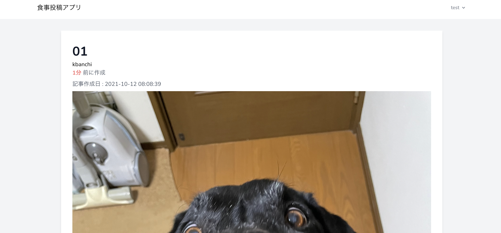
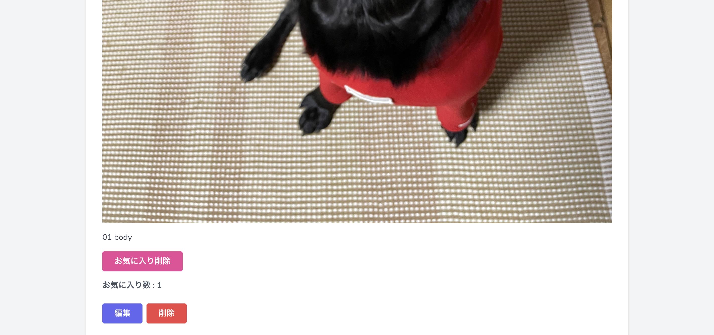
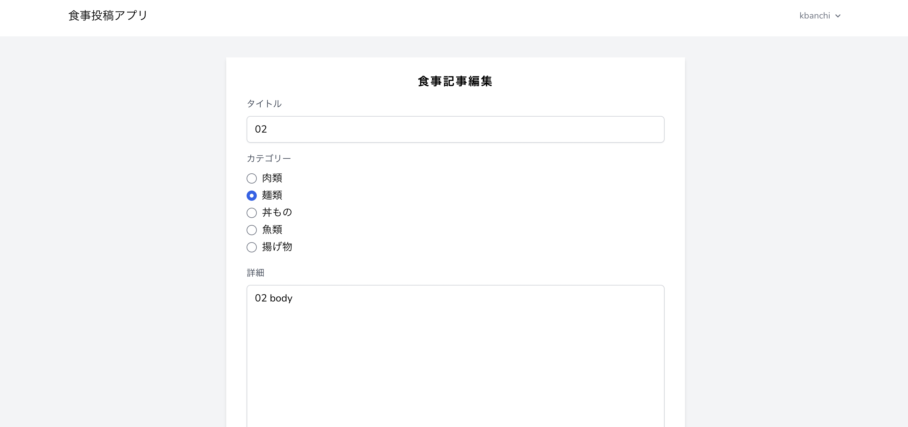
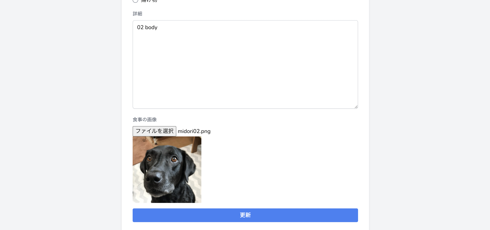

# meal_app

## About This App
* 食事投稿アプリ
* https://github.com/elites-team/camp202109-laravel/blob/master/doc/08_laravel/07_hare_blog/exercise/meal_app/01.md

## 性能チェック
* 講義中にお気に入り(Likeテーブル)に関する性能の話があったので、確認してみました
* faker&seederで10万件ほどデータを用意し、性能をチェック
* 結論、レスポンスタイムは問題なし
* SQLについて、Likeテーブルの索引(外部キー索引)が効き、ちゃんとIndexScanになっていました
```
mysql> explain select * from `likes` where `likes`.`post_id` in (801, 802, 803, 804);
+----+-------------+-------+------------+-------+-----------------------+-----------------------+---------+------+------+----------+-----------------------+
| id | select_type | table | partitions | type  | possible_keys         | key                   | key_len | ref  | rows | filtered | Extra                 |
+----+-------------+-------+------------+-------+-----------------------+-----------------------+---------+------+------+----------+-----------------------+
|  1 | SIMPLE      | likes | NULL       | range | likes_post_id_foreign | likes_post_id_foreign | 8       | NULL | 4000 |   100.00 | Using index condition |
+----+-------------+-------+------------+-------+-----------------------+-----------------------+---------+------+------+----------+-----------------------+
1 row in set, 1 warning (0.00 sec)
```

## 画面

### 一覧画面





### 登録画面





### 詳細画面(ログイン済)

自分の投稿




他の人の投稿



お気に入り済


未ログイン


### 編集画面




